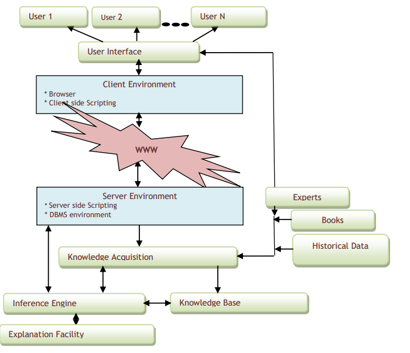
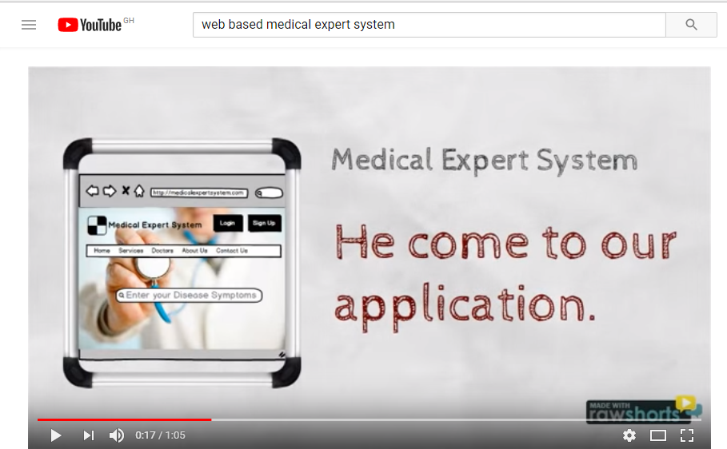
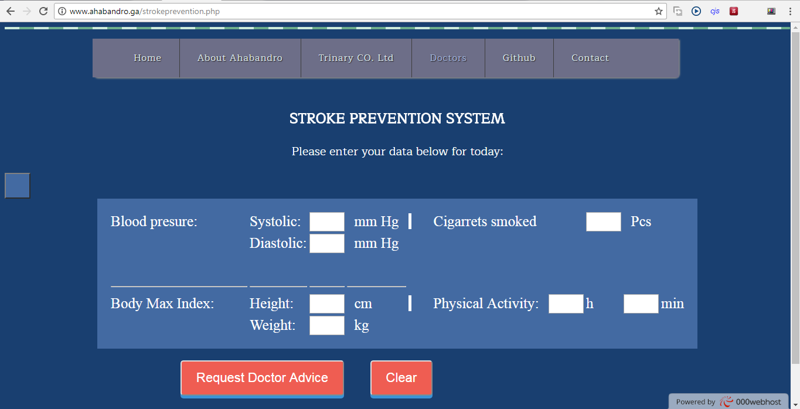

# AHABANDRO---African-Herbal-Medicine-Expert-System
A WEB BASED HERBAL MEDICINE EXPERT SYSTEM FOR DISEASE DIAGNOSIS AND TREATMENT
   
# AHABANDRO
website on test at: http://www.ahabandro.ga
Ahabandro is a web based expert system that facilitates the diagnose, prevention and treatment of Stroke by prescribing African (Using Ghana as a case study) herbal medicine. 
Stroke exemplifies one of Africa's major health challenges. Stroke is the rapid loss of brain function due to disturbance in the blood supply to the brain. This can be due to lack of blood flow or a hemorrhage. Stroke is a leading cause of death and disability worldwide. Some of its early signs include sudden loss of memory, loss of speech suddenly, loss of eye suddenly, weakness or numbness with one side of the body, change in mental status, loss of consciousness suddenly, change in character, loss of intelligence, and hypersomnia, bleeding from nose, especially repeated bleeding among others.
There are many causes of stroke but the main ones are always related to high cholesterol level and poor blood circulation:

High blood sugar level causes stroke. Between 30-40% of people who get stroke suffer from diabetes,Heart problem- Embolic and Hypoperfusion are the causes of the heart problem, which result in stroke.

Hypertension is also one of the causes of stroke. 93% of Stroke patients with hemorrhage in the brain suffer from hypertension.

Arteriosclerosis is the main cause of stroke. High cholesterol level is the main cause. 70% of stroke patients are affected by this particular disease

The main objective for developing Ahabandro is to help prevent the prevalence of stroke in Africa (especially in rural communities) using indigenouse knowledge based system and technologies.

# SYSTEM ARCHITECTURE

# TOOLS

PROGRAMMING LANGUAGE - Specifically python

PYTHON LIBRARY- PyKnow: Expert Systems for Python or Pyke

IDE - PyCharm

# WEBREADER API INTEGRATION

WebReader is a free and open source JavaScript library developed for modern web browsers. Built using emerging functionality, WebReader can be integrated into any web page. Underneath, WebReader relies on the Web Speech API to offer speech recognition and speech synthesis functionality. It integrates a subset of the features provided by classic screen readers.

A major advantage of WebReader is that it does not require any additional software to be installed on a user's machine, apart from a supported web browser.

It is built with the hope to help users with disabilities better interact with web pages. The intention is not to replace screen readers, but with basic features embedded into a web page, any user with an internet connection and a headset will be able to browse a website. It frees people form constantly looking at the screen which is useful for anyone which is on the move

# WATCH A VIDEO OF WHAT WE HOPE TO ACHIEVE

# SOFTWARE DEVELOPMENT MODEL
Rapid Application Development (RAD) model will be employed. This means development will be incremental. In RAD model the components or functions are developed in parallel as if they were mini projects. The developments are time boxed, delivered and then assembled into a working prototype.

# THE PROTOTYPE
An incomplete version of the software program will be developed. The prototype  will be developed using PHP and not Python. The prototype will be open source on github  but the Full version which is developed with Python will not be open source. 
Below is the interface design of the prototype though its still an ongoing development:

   

# COPYRIGHT INFORMATION
AHABANDRO is copyrighted and will forever remain the property of Trinary Company Limited. The open source project gives privileges to the general public to study, change, and distribute the software to anyone and for any purpose. 
